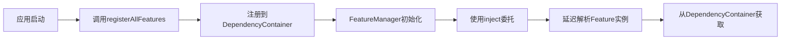

# KMP 注解驱动的依赖注入架构设计

## 1. 架构概述

基于现有的分层架构（shared → feature-XXX → manager-XXX），设计一个使用 KSP 编译时代码生成的注解驱动依赖注入方案。

### 当前架构分析

```
shared/
├── architecture/
│   ├── di/DependencyContainer.kt          # 现有DI容器
│   ├── feature/Feature.kt                 # Feature基类
│   ├── manager/Manager.kt                 # Manager基类
│   ├── manager/FeatureManager.kt          # Feature管理器
│   └── manager/claim/IFeatureManager.kt   # 接口定义
```

### 目标使用方式

```kotlin
// 1. Feature定义时使用注解
@FeatureProvider
class PermissionFeature : Feature() {
    override val name = "PermissionFeature"
}

// 2. 通过扩展属性直接访问
val IFeatureManager.permission: PermissionFeature by inject()

// 3. 在代码中使用
val IManager.feature: IFeatureManager by inject()
manager.feature.permission.checkPermission(...)
```

## 2. 核心设计

### 2.1 注解定义

#### [`@FeatureProvider`](shared/src/commonMain/kotlin/com/wgt/architecture/di/annotations/FeatureProvider.kt)
标记一个类为 Feature 提供者，KSP 将为其生成注册代码和扩展属性。

```kotlin
@Target(AnnotationTarget.CLASS)
@Retention(AnnotationRetention.SOURCE)
annotation class FeatureProvider(
    val name: String = "",           // Feature名称，默认使用类名
    val lifecycle: Lifecycle = Lifecycle.SINGLETON
)
```

#### [`@InjectFeature`](shared/src/commonMain/kotlin/com/wgt/architecture/di/annotations/InjectFeature.kt)
标记扩展属性的注入点（可选，主要用于自定义）。

```kotlin
@Target(AnnotationTarget.PROPERTY)
@Retention(AnnotationRetention.SOURCE)
annotation class InjectFeature(
    val featureClass: KClass<*>
)
```

### 2.2 KSP 处理器架构

```
ksp-processor/
├── src/main/kotlin/
│   ├── FeatureProcessorProvider.kt        # KSP入口
│   ├── FeatureProcessor.kt                # 主处理器
│   ├── generators/
│   │   ├── ExtensionGenerator.kt          # 生成扩展属性
│   │   └── RegistrationGenerator.kt       # 生成注册代码
│   └── models/
│       └── FeatureInfo.kt                 # Feature元数据
```

### 2.3 代码生成策略

#### 生成的扩展属性文件
位置: `build/generated/ksp/commonMain/kotlin/com/wgt/architecture/di/generated/FeatureExtensions.kt`

```kotlin
// 自动生成的代码
package com.wgt.architecture.di.generated

import com.wgt.architecture.di.inject
import com.wgt.architecture.manager.claim.IFeatureManager
import com.wgt.feature.permission.PermissionFeature

/**
 * Auto-generated extension property for PermissionFeature
 */
val IFeatureManager.permission: PermissionFeature by inject()

/**
 * Auto-generated extension property for MediaFeature
 */
val IFeatureManager.media: MediaFeature by inject()
```

#### 生成的注册代码
位置: `build/generated/ksp/commonMain/kotlin/com/wgt/architecture/di/generated/FeatureRegistry.kt`

```kotlin
// 自动生成的代码
package com.wgt.architecture.di.generated

import com.wgt.architecture.di.Lifecycle
import com.wgt.architecture.feature.registerFeature
import com.wgt.feature.permission.PermissionFeature

/**
 * Auto-generated feature registration
 */
fun registerAllFeatures() {
    registerFeature<PermissionFeature>(Lifecycle.SINGLETON) {
        PermissionFeature()
    }
    
    registerFeature<MediaFeature>(Lifecycle.SINGLETON) {
        MediaFeature()
    }
}
```

## 3. 实现步骤

### 3.1 模块结构

```
media-manager/frontend/
├── ksp-processor/                         # 新增KSP处理器模块
│   ├── build.gradle.kts
│   └── src/main/kotlin/...
├── shared/                                # 现有shared模块
│   ├── src/commonMain/kotlin/
│   │   └── com/wgt/architecture/di/
│   │       └── annotations/               # 新增注解定义
└── feature-permission/                    # 现有feature模块
    └── src/commonMain/kotlin/
        └── PermissionFeature.kt           # 添加@FeatureProvider注解
```

### 3.2 KSP 处理流程

```mermaid
graph TD
    A[源代码扫描] --> B[查找@FeatureProvider注解]
    B --> C[提取Feature元数据]
    C --> D[验证Feature类型]
    D --> E[生成扩展属性代码]
    D --> F[生成注册代码]
    E --> G[写入生成文件]
    F --> G
    G --> H[编译时集成]
```

### 3.3 依赖注入流程



## 4. 关键技术点

### 4.1 属性名称生成规则

```kotlin
// PermissionFeature -> permission
// MediaFeature -> media
// UserProfileFeature -> userProfile

fun generatePropertyName(className: String): String {
    return className
        .removeSuffix("Feature")
        .replaceFirstChar { it.lowercase() }
}
```

### 4.2 类型安全保证

- KSP 编译时验证 Feature 类型继承自 [`Feature`](shared/src/commonMain/kotlin/com/wgt/architecture/feature/Feature.kt) 或 [`IFeature`](shared/src/commonMain/kotlin/com/wgt/architecture/feature/Feature.kt:12)
- 生成的扩展属性使用具体类型，避免类型转换
- [`inject()`](shared/src/commonMain/kotlin/com/wgt/architecture/di/DependencyContainer.kt:227) 委托提供延迟初始化和类型推断

### 4.3 生命周期管理

```kotlin
// Feature注册时指定生命周期
@FeatureProvider(lifecycle = Lifecycle.SINGLETON)
class PermissionFeature : Feature()

// 生成的注册代码会使用指定的生命周期
registerFeature<PermissionFeature>(Lifecycle.SINGLETON) {
    PermissionFeature()
}
```

### 4.4 多模块支持

每个 feature-XXX 模块独立处理：
- KSP 在每个模块中独立运行
- 生成的代码放在各自模块的 build/generated 目录
- 通过统一的 [`registerAllFeatures()`](shared/src/commonMain/kotlin/com/wgt/architecture/di/generated/FeatureRegistry.kt) 聚合

## 5. 集成方案

### 5.1 Gradle 配置

#### 根项目 [`build.gradle.kts`](build.gradle.kts)
```kotlin
plugins {
    id("com.google.devtools.ksp") version "2.3.0-1.0.29" apply false
}
```

#### [`shared/build.gradle.kts`](shared/build.gradle.kts)
```kotlin
plugins {
    id("com.google.devtools.ksp")
}

dependencies {
    add("kspCommonMainMetadata", project(":ksp-processor"))
    add("kspAndroid", project(":ksp-processor"))
    add("kspIosArm64", project(":ksp-processor"))
    add("kspIosSimulatorArm64", project(":ksp-processor"))
}
```

#### [`feature-permission/build.gradle.kts`](feature-permission/build.gradle.kts)
```kotlin
plugins {
    id("com.google.devtools.ksp")
}

dependencies {
    add("kspCommonMainMetadata", project(":ksp-processor"))
    add("kspAndroid", project(":ksp-processor"))
    add("kspIosArm64", project(":ksp-processor"))
    add("kspIosSimulatorArm64", project(":ksp-processor"))
}
```

### 5.2 初始化流程

```kotlin
// 在应用启动时调用
fun initializeApplication() {
    // 1. 初始化Manager
    InitManager()
    
    // 2. 自动注册所有Feature（KSP生成）
    registerAllFeatures()
    
    // 3. 激活FeatureManager
    GlobalScope.launch {
        manager.feature.activate()
    }
}
```

## 6. 迁移策略

### 6.1 现有代码迁移

#### 迁移前（手动注册）
```kotlin
// PermissionFeatureInit.kt
fun InitPermissionFeature() {
    registerFeature {
        PermissionFeature()
    }
}

val IFeatureManager.permission: PermissionFeature by inject()
```

#### 迁移后（注解驱动）
```kotlin
// PermissionFeature.kt
@FeatureProvider
class PermissionFeature : Feature() {
    override val name = "PermissionFeature"
}

// 扩展属性自动生成，无需手动定义
// 注册代码自动生成，无需InitPermissionFeature()
```

### 6.2 兼容性保证

- 保留现有的 [`inject()`](shared/src/commonMain/kotlin/com/wgt/architecture/di/DependencyContainer.kt:227) 函数
- 保留现有的 [`registerFeature()`](shared/src/commonMain/kotlin/com/wgt/architecture/feature/Feature.kt:89) 函数
- 支持手动注册和自动注册混用
- 逐步迁移，不影响现有功能

## 7. 优势分析

### 7.1 开发体验提升

- **减少样板代码**: 无需手动编写 Init 函数和扩展属性
- **类型安全**: 编译时检查，避免运行时错误
- **IDE 支持**: 生成的代码提供完整的代码补全和导航

### 7.2 性能优化

- **编译时处理**: 零运行时反射开销
- **延迟初始化**: 使用 [`inject()`](shared/src/commonMain/kotlin/com/wgt/architecture/di/DependencyContainer.kt:227) 委托，按需创建
- **单例管理**: 通过 [`DependencyContainer`](shared/src/commonMain/kotlin/com/wgt/architecture/di/DependencyContainer.kt:34) 统一管理

### 7.3 可维护性

- **统一规范**: 所有 Feature 使用相同的注册方式
- **自动发现**: 新增 Feature 自动注册，无需手动维护列表
- **清晰架构**: 注解明确标识 Feature 提供者

## 8. 扩展能力

### 8.1 支持自定义属性名

```kotlin
@FeatureProvider(name = "perm")
class PermissionFeature : Feature()

// 生成: val IFeatureManager.perm: PermissionFeature by inject()
```

### 8.2 支持条件注册

```kotlin
@FeatureProvider(
    condition = "android",  // 仅在Android平台注册
    lifecycle = Lifecycle.SINGLETON
)
class AndroidSpecificFeature : Feature()
```

### 8.3 支持依赖声明

```kotlin
@FeatureProvider(
    dependencies = [PermissionFeature::class]  // 声明依赖
)
class MediaFeature : Feature()
```

## 9. 测试策略

### 9.1 KSP 处理器测试

- 使用 KSP 测试框架验证代码生成
- 测试各种注解配置场景
- 验证生成代码的正确性

### 9.2 集成测试

- 测试 Feature 自动注册
- 测试扩展属性访问
- 测试生命周期管理

### 9.3 性能测试

- 对比手动注册和自动注册的性能
- 验证编译时间影响
- 测试运行时性能

## 10. 文档和示例

### 10.1 使用文档

- 注解使用指南
- 迁移步骤说明
- 最佳实践建议

### 10.2 示例代码

- 简单 Feature 示例
- 复杂 Feature 示例
- 多模块集成示例

## 11. 风险和挑战

### 11.1 技术风险

- **KSP 版本兼容性**: 需要与 Kotlin 版本匹配
- **多平台支持**: 确保 iOS/Android 都能正常工作
- **增量编译**: KSP 可能影响编译速度

### 11.2 缓解措施

- 固定 KSP 版本，定期更新
- 在所有平台上进行充分测试
- 优化 KSP 处理器性能
- 使用增量编译配置

## 12. 实施计划

### Phase 1: 基础设施（1-2天）
- 创建 ksp-processor 模块
- 定义核心注解
- 配置 Gradle 构建

### Phase 2: KSP 处理器（2-3天）
- 实现 FeatureProcessor
- 实现代码生成器
- 编写单元测试

### Phase 3: 集成和测试（1-2天）
- 集成到现有项目
- 迁移 PermissionFeature
- 端到端测试

### Phase 4: 文档和优化（1天）
- 编写使用文档
- 性能优化
- 代码审查

## 13. 总结

该方案通过 KSP 编译时代码生成，实现了一个类型安全、高性能、易用的注解驱动依赖注入系统。核心优势：

1. **零运行时开销**: 所有处理在编译时完成
2. **类型安全**: 编译时检查，避免运行时错误
3. **开发友好**: 减少样板代码，提升开发效率
4. **架构清晰**: 统一的 Feature 注册和访问方式
5. **易于扩展**: 支持自定义配置和条件注册

该方案完全兼容现有架构，可以逐步迁移，不影响现有功能。
