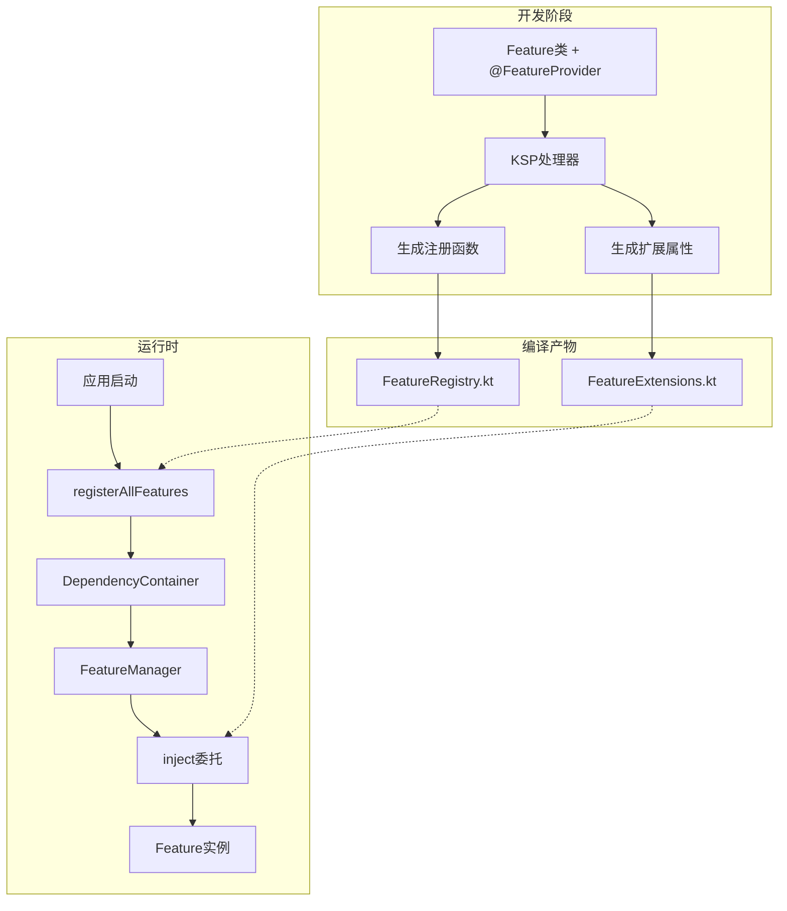
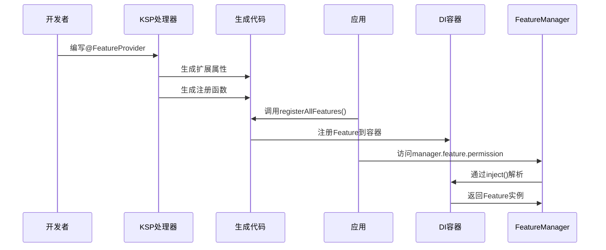

# KMP 注解驱动依赖注入 - 架构总结

## 核心设计理念

通过 KSP 编译时代码生成，实现零运行时开销的类型安全依赖注入系统。

## 系统架构图



## 使用流程对比

### 迁移前（手动方式）

```kotlin
// 1. 定义Feature
class PermissionFeature : Feature() {
    override val name = "PermissionFeature"
}

// 2. 手动编写初始化函数
fun InitPermissionFeature() {
    registerFeature { PermissionFeature() }
}

// 3. 手动编写扩展属性
val IFeatureManager.permission: PermissionFeature by inject()

// 4. 应用启动时手动调用
InitPermissionFeature()
```

### 迁移后（注解驱动）

```kotlin
// 1. 添加注解即可
@FeatureProvider
class PermissionFeature : Feature() {
    override val name = "PermissionFeature"
}

// 2. 扩展属性自动生成
// 3. 注册函数自动生成
// 4. 应用启动时统一调用
registerAllFeatures()  // 自动注册所有Feature
```

## 关键组件

### 1. 注解定义
- **[@FeatureProvider](shared/src/commonMain/kotlin/com/wgt/architecture/di/annotations/FeatureProvider.kt)**: 标记Feature类
- 支持自定义属性名和生命周期

### 2. KSP处理器
- **[FeatureProcessor](ksp-processor/src/main/kotlin/com/wgt/ksp/FeatureProcessor.kt)**: 扫描注解并生成代码
- 生成类型安全的扩展属性
- 生成统一的注册函数

### 3. 生成代码
- **FeatureExtensions.kt**: 扩展属性（如 `val IFeatureManager.permission`）
- **FeatureRegistry.kt**: 注册函数（`registerAllFeatures()`）

### 4. 依赖注入
- **[DependencyContainer](shared/src/commonMain/kotlin/com/wgt/architecture/di/DependencyContainer.kt)**: 现有DI容器
- **[inject()](shared/src/commonMain/kotlin/com/wgt/architecture/di/DependencyContainer.kt:227)**: 属性委托

## 数据流图



## 核心优势

| 特性 | 手动方式 | 注解驱动 |
|------|---------|---------|
| 样板代码 | 需要Init函数和扩展属性 | 仅需一个注解 |
| 类型安全 | 手动保证 | 编译时保证 |
| 维护成本 | 每个Feature需要3个文件 | 每个Feature仅1个文件 |
| 运行时开销 | 无 | 无（编译时处理） |
| IDE支持 | 需要手动编写 | 自动生成，完整支持 |
| 错误检测 | 运行时 | 编译时 |

## 项目结构

```
media-manager/frontend/
├── ksp-processor/                          # 新增：KSP处理器
│   ├── build.gradle.kts
│   └── src/main/kotlin/com/wgt/ksp/
│       ├── FeatureProcessorProvider.kt
│       └── FeatureProcessor.kt
│
├── shared/                                 # 更新：添加注解
│   ├── build.gradle.kts                    # 添加KSP插件
│   └── src/commonMain/kotlin/
│       └── com/wgt/architecture/di/
│           └── annotations/
│               └── FeatureProvider.kt      # 新增注解
│
├── feature-permission/                     # 更新：使用注解
│   ├── build.gradle.kts                    # 添加KSP插件
│   └── src/commonMain/kotlin/
│       └── PermissionFeature.kt            # 添加@FeatureProvider
│       └── PermissionFeatureInit.kt        # 删除此文件
│
└── composeApp/                             # 更新：初始化方式
    └── src/androidMain/kotlin/
        └── MediaApplication.kt             # 调用registerAllFeatures()
```

## 实施步骤

### Phase 1: 基础设施（优先级：高）
1. 创建 `ksp-processor` 模块
2. 定义 `@FeatureProvider` 注解
3. 配置 Gradle 和 KSP 插件

### Phase 2: 核心实现（优先级：高）
4. 实现 `FeatureProcessor` 主逻辑
5. 实现扩展属性生成器
6. 实现注册函数生成器

### Phase 3: 集成测试（优先级：中）
7. 迁移 `PermissionFeature` 作为示例
8. 更新应用初始化代码
9. 端到端测试验证

### Phase 4: 完善优化（优先级：低）
10. 编写使用文档
11. 性能测试和优化
12. 迁移其他 Feature

## 技术要点

### 属性名生成规则
```kotlin
PermissionFeature  -> permission
MediaFeature       -> media
UserProfileFeature -> userProfile
```

### 生成代码示例

**FeatureExtensions.kt**
```kotlin
// Auto-generated
val IFeatureManager.permission: PermissionFeature by inject()
val IFeatureManager.media: MediaFeature by inject()
```

**FeatureRegistry.kt**
```kotlin
// Auto-generated
fun registerAllFeatures() {
    registerFeature<PermissionFeature>(Lifecycle.SINGLETON) {
        PermissionFeature()
    }
    registerFeature<MediaFeature>(Lifecycle.SINGLETON) {
        MediaFeature()
    }
}
```

## 兼容性保证

- ✅ 保留现有 [`inject()`](shared/src/commonMain/kotlin/com/wgt/architecture/di/DependencyContainer.kt:227) 函数
- ✅ 保留现有 [`registerFeature()`](shared/src/commonMain/kotlin/com/wgt/architecture/feature/Feature.kt:89) 函数
- ✅ 支持手动注册和自动注册混用
- ✅ 逐步迁移，不影响现有功能
- ✅ 完全向后兼容

## 性能影响

| 阶段 | 影响 | 说明 |
|------|------|------|
| 编译时 | +5-10秒 | KSP处理时间（首次） |
| 编译时 | +1-2秒 | 增量编译（后续） |
| 运行时 | 0 | 无额外开销 |
| 包大小 | +几KB | 生成的代码 |

## 风险评估

| 风险 | 等级 | 缓解措施 |
|------|------|---------|
| KSP版本兼容 | 低 | 固定版本，定期更新 |
| 多平台支持 | 低 | 充分测试iOS/Android |
| 编译速度 | 中 | 启用增量编译 |
| 学习曲线 | 低 | 提供详细文档 |

## 后续扩展

### 可选功能（未来考虑）

1. **条件注册**
```kotlin
@FeatureProvider(platform = "android")
class AndroidOnlyFeature : Feature()
```

2. **依赖声明**
```kotlin
@FeatureProvider(dependencies = [PermissionFeature::class])
class MediaFeature : Feature()
```

3. **自动初始化**
```kotlin
@FeatureProvider(autoInit = true)
class AutoInitFeature : Feature()
```

## 文档清单

- ✅ [架构设计文档](annotation-based-injection-architecture.md)
- ✅ [实现指南](implementation-guide.md)
- ✅ [架构总结](architecture-summary.md)（本文档）
- ⏳ API使用文档（待实现后编写）
- ⏳ 迁移指南（待实现后编写）

## 下一步行动

准备好开始实施时，可以切换到 **Code** 模式，按照以下顺序执行：

1. 创建 `ksp-processor` 模块
2. 实现注解和处理器
3. 配置 Gradle 构建
4. 迁移第一个 Feature 作为示例
5. 测试验证

---

**准备好开始实施了吗？** 如果对设计有任何疑问或需要调整，请告诉我。否则，我们可以切换到 Code 模式开始实现。
